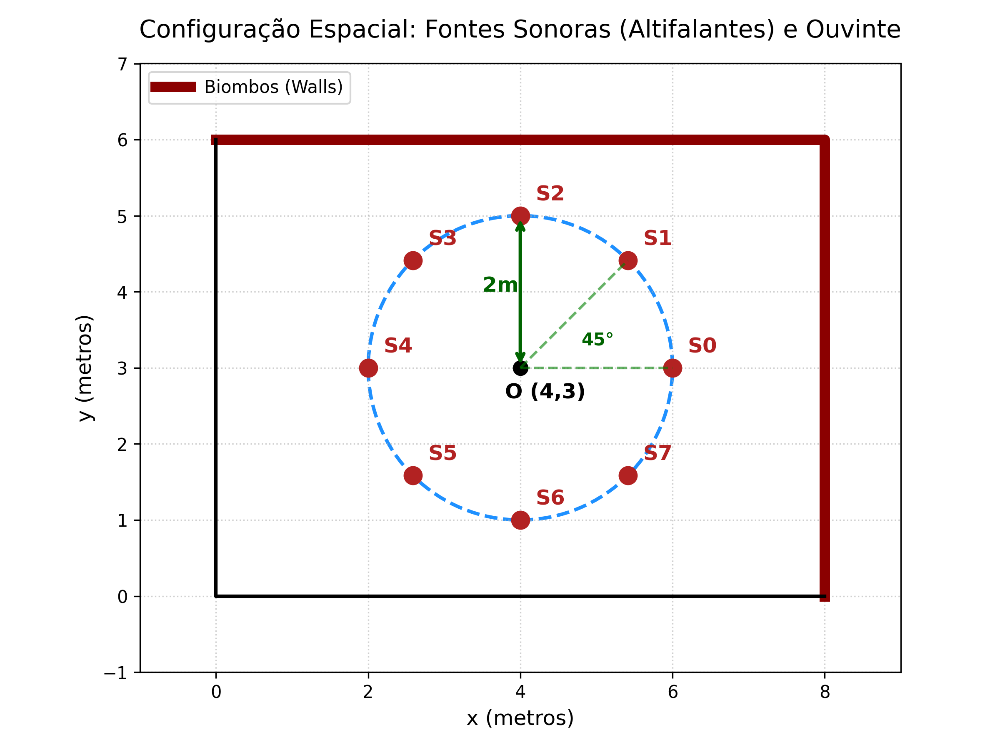
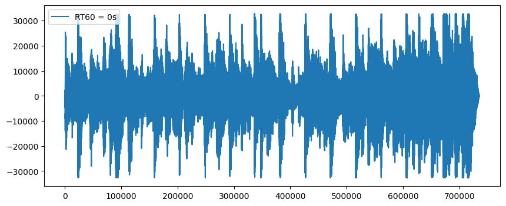
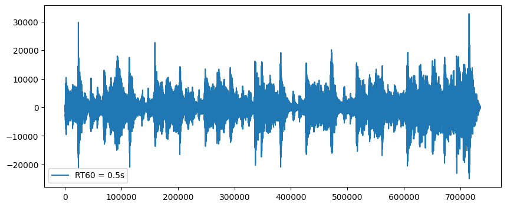

<a id="readme-top"></a>

<!-- PROJECT LOGO & HEADER -->
<br />
<div align="center">
  <h3 align="center">Binaural Audio Simulation</h3>

  <p align="center">
    A Python-based simulation engine for spatial audio rendering and room acoustics.
    <br />
    <br />
    <a href="#about-the-project"><strong>Explore the Documentation »</strong></a>
    <br />
    <br />
    <a href="https://github.com/GuilhermeGraca/python-binaural-audio-simulation/issues">Report Bug</a>
    &middot;
    <a href="https://github.com/GuilhermeGraca/python-binaural-audio-simulation/issues">Request Feature</a>
  </p>
</div>

<!-- TABLE OF CONTENTS -->
<details>
  <summary>Table of Contents</summary>
  <ol>
    <li>
      <a href="#about-the-project">About The Project</a>
      <ul>
        <li><a href="#built-with">Built With</a></li>
        <li><a href="#features--key-highlights">Features & Key Highlights</a></li>
      </ul>
    </li>
    <li><a href="#lessons-learned">Lessons Learned</a></li>
    <li>
      <a href="#getting-started">Getting Started</a>
      <ul>
        <li><a href="#prerequisites">Prerequisites</a></li>
        <li><a href="#installation--running-locally">Installation & Running Locally</a></li>
      </ul>
    </li>
    <li><a href="#usage">Usage</a></li>
    <li><a href="#contact">Contact</a></li>
    <li><a href="#acknowledgments">Acknowledgments</a></li>
  </ol>
</details>

---

<!-- ABOUT THE PROJECT -->
## About The Project

<div align="center">
  
  <br />
  <p align="center">
    <em>Spatial Configuration: Listener (O) and 8 Surround Sound Sources (S0-S7).</em>
  </p>
</div>

This repository contains **Binaural Audio Simulation**, an academic project developed from scratch for the *Comunicação de Sinais Multimedia* course at **ISEL (Instituto Superior de Engenharia de Lisboa)** in 2025. 

The primary goal of this project is to simulate and synthesize audio fields within a horizontal room plane, exploring monaural propagation, binaural audition via HRTF, and multichannel sound reproduction using VBAP.

### Understanding the Simulation

The image above illustrates the mathematical and spatial configuration used to compute the audio in this project:
* **The Room**: The space is defined by boundaries (Biombos/walls) on a 2D Cartesian plane (8m width, 6m height). These boundaries are used to calculate the physical reflections and reverberation of the sound waves.
* **The Listener (O)**: The central point at coordinate `(4,3)` represents the listener's head. 
* **The Sound Sources (S0 - S7)**: Eight virtual speakers are placed in a perfect circle around the listener at a distance of `2m`, spaced every `45°`.

The Python simulation calculates the exact acoustic path—including direct sound propagation delays and acoustic reflections on the walls—from each of these 8 sound sources to the listener. To make this simulation realistic, we rely on two major acoustic concepts:

* **HRTF (Head-Related Transfer Function)**: A mathematical filter that mimics how sound waves interact with human anatomy (head, shoulders, and outer ears) before reaching the eardrums. By applying HRTFs to audio signals, we trick the brain into pinpointing exactly where a sound is coming from in 3D space, creating a surround sound illusion using only standard stereo headphones.
* **VBAP (Vector Based Amplitude Panning)**: A technique used to position a virtual sound (like an instrument) anywhere in space by intelligently distributing its volume across multiple physical speakers. It calculates the exact amplitude (gain) that each speaker needs to play so that the listener perceives the sound coming from a specific direction.

### 🔊 Audio Results

The resulting calculation of this entire physical setup can be heard below. When you listen to this file with headphones, your brain interprets the HRTF filters and the simulated room reflections, allowing you to actually *feel* where the sound sources are positioned around you.

* **[🎧 Listen to Final Binaural Simulation (`somFinalHRTFdosAltifalantes.wav`)](./audio/generated/somFinalHRTFdosAltifalantes.wav)**

*(Note: GitHub may require you to download the `.wav` file to play it, or you can run the notebook to generate and listen to it locally).*

<p align="right">(<a href="#readme-top">back to top</a>)</p>

---

### Built With

* [![Python][Python-badge]][Python-url]
* [![Jupyter][Jupyter-badge]][Jupyter-url]
* [![NumPy][NumPy-badge]][NumPy-url]
* [![SciPy][SciPy-badge]][SciPy-url]
* [![Matplotlib][Matplotlib-badge]][Matplotlib-url]

<p align="right">(<a href="#readme-top">back to top</a>)</p>

---

### Features & Key Highlights

* **Monaural Propagation**: Simulates direct sound fields, first-order reflections, and room reverberation at a specific point.
* **Binaural Audition with HRTF**: Models how a listener perceives the orchestra using Head-Related Transfer Functions, adjusting for sound absorption.
* **VBAP Multichannel Playback**: Uses Vector Based Amplitude Panning to position virtual sound sources across a multichannel speaker setup.
* **Audio DSP Pipelines**: Built from scratch using mathematical models and Python libraries to filter, convolve, and synthesize `.wav` files.

<p align="right">(<a href="#readme-top">back to top</a>)</p>

---

<!-- LESSONS LEARNED -->
## Lessons Learned

* **Acoustic Modeling**: Consolidated knowledge on the impact of room parameters like direct fields, absorption coefficients, and reverberation times.
* **Spatial Audio Techniques**: Learned how to apply Head-Related Transfer Functions to create realistic 3D auditory illusions for headphones.
* **Vector Based Amplitude Panning**: Understood the mathematics behind calculating speaker gains to pan a virtual sound source between physical speakers.
* **Digital Signal Processing**: Improved practical skills in Python for audio signal manipulation, filtering, and wave generation.

<p align="right">(<a href="#readme-top">back to top</a>)</p>

---

<!-- GETTING STARTED -->
## Getting Started

Follow these instructions to set up a local copy of the project on your machine.

### Prerequisites

* Python 3.8+
* Jupyter Notebook (or JupyterLab)
* Standard DSP libraries: `numpy`, `scipy`, `matplotlib`

### Installation & Running Locally

1. **Clone the repository**:
   ```sh
   git clone https://github.com/GuilhermeGraca/python-binaural-audio-simulation.git
   ```
2. **Navigate to the project folder**:
   ```sh
   cd python-binaural-audio-simulation
   ```
3. **Install the required packages**:
   ```sh
   pip install numpy scipy matplotlib jupyter
   ```
4. **Run the Jupyter Notebook**:
   ```sh
   jupyter notebook Trabalho2_CPS_A51736_A51827_A51829.ipynb
   ```

<p align="right">(<a href="#readme-top">back to top</a>)</p>

---

<!-- USAGE -->
## Usage

To use the simulation, simply run the cells inside the Jupyter Notebook sequentially. The code will read the input audio files, perform the digital signal processing calculations, and output newly synthesized `.wav` files corresponding to the monaural, binaural, and multichannel simulations. 

You can also analyze the generated plots inside the notebook to visualize the waveforms and understand the sound field behavior.

### Visualizations

Here is a glimpse of the digital signal processing visualizations generated by the notebook:

<div align="center">
  
  &nbsp;
  
</div>

<br/>

**Generated files (inside `audio/generated/`) include:**
* `somOndaDireta.wav`
* `somFinalPrimeirasReflexões.wav`
* `campo_total_RT60_*.wav`
* `somFinalHRTFdosAltifalantes.wav`

<p align="right">(<a href="#readme-top">back to top</a>)</p>

---

<!-- CONTACT -->
## Contact

Guilherme Graça - [LinkedIn](https://www.linkedin.com/in/guilhermegraca) - [GitHub](https://github.com/GuilhermeGraca)

<p align="right">(<a href="#readme-top">back to top</a>)</p>

---

<!-- ACKNOWLEDGMENTS -->
## Acknowledgments

* **ISEL (Instituto Superior de Engenharia de Lisboa)** for providing the academic environment and resources.
* **Professor Joel Paulo** for the guidance throughout the *Comunicação de Sinais Multimedia* course.
* **Martim Ramos** and **Rodrigo Monteiro** for the collaboration on this project.

<p align="right">(<a href="#readme-top">back to top</a>)</p>

<!-- MARKDOWN LINKS & IMAGES -->
[Python-badge]: https://img.shields.io/badge/Python-3776AB?style=for-the-badge&logo=python&logoColor=white
[Python-url]: https://www.python.org/
[Jupyter-badge]: https://img.shields.io/badge/Jupyter-F37626?style=for-the-badge&logo=jupyter&logoColor=white
[Jupyter-url]: https://jupyter.org/
[NumPy-badge]: https://img.shields.io/badge/NumPy-013243?style=for-the-badge&logo=numpy&logoColor=white
[NumPy-url]: https://numpy.org/
[SciPy-badge]: https://img.shields.io/badge/SciPy-8CAAE6?style=for-the-badge&logo=scipy&logoColor=white
[SciPy-url]: https://scipy.org/
[Matplotlib-badge]: https://img.shields.io/badge/Matplotlib-ffffff?style=for-the-badge&logo=matplotlib&logoColor=black
[Matplotlib-url]: https://matplotlib.org/
